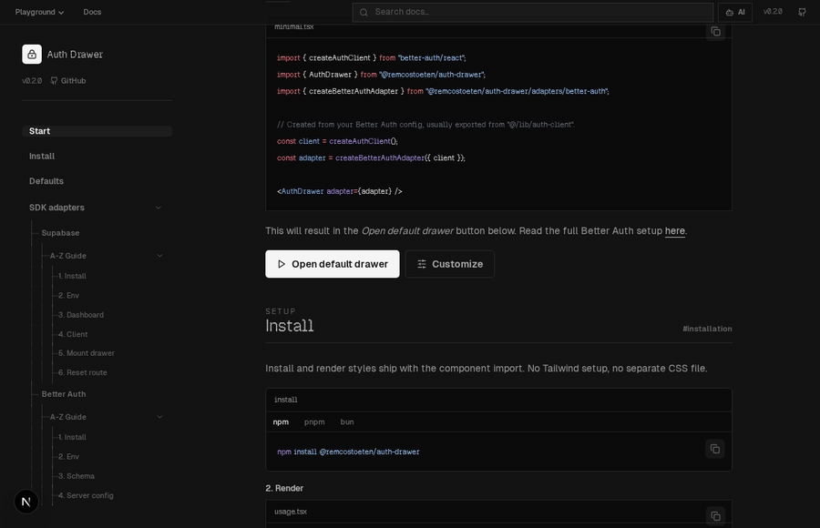
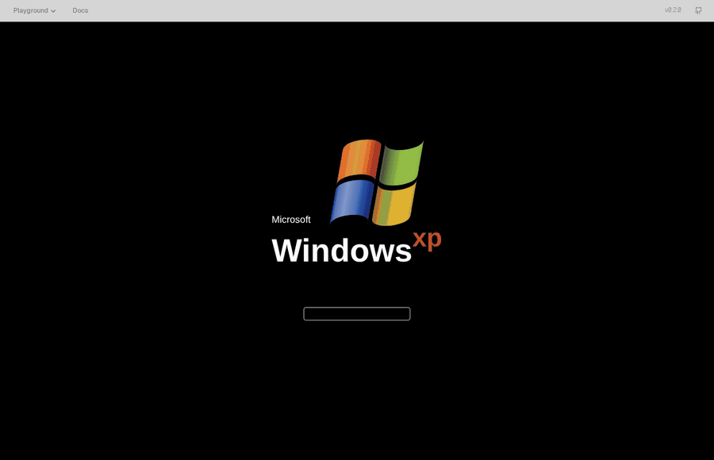

<p align="center">
  
</p>

# Auth Drawer

Configurable React auth drawer and modal for product teams that want a polished
sign-in surface without rebuilding OAuth buttons, credential forms, drawer
motion, validation states, and auth-provider glue for every app.

<p>
  <a href="https://www.npmjs.com/package/@remcostoeten/auth-drawer"><strong>npm package</strong></a>
  ·
  <a href="https://auth-drawer.remcostoeten.nl/docs"><strong>live docs</strong></a>
  ·
  <a href="./API.md"><strong>API reference</strong></a>
</p>

<p>
  
  
  
  
</p>

## What It Is

`@remcostoeten/auth-drawer` is a provider-agnostic auth UI primitive. It ships a
typed adapter boundary, accessible drawer/modal presentation, OAuth provider
controls, email/password flows, password reset affordances, session hooks, and
configuration for copy, layout, triggers, and motion.

Use it when you already have an auth backend and need a reliable front-end auth
surface that can be dropped into different apps without forking UI code.

## Highlights

- Drawer or modal presentation with responsive mobile behavior.
- Email/password sign-in, registration, forgot-password, and optional live
  password-match feedback.
- OAuth buttons for GitHub, Google, Apple, Discord, TikTok, plus overflow
  handling for larger provider sets.
- Typed adapters for Better Auth, Supabase, Auth.js/NextAuth, Clerk, Firebase,
  custom JWT/REST APIs, Passport sessions, and mock demos.
- `AuthProvider`, `useAuth`, and trigger-store APIs for global session state and
  controlled drawer opening.
- Configurable copy, provider list, layout, backdrop, animation, width, desktop
  position, and trigger behavior.
- Live Next.js showcase with docs search, configurator, API tables, and themed
  playground examples.

## Demos

The regular demo opens the stock drawer from the docs CTA and submits against
the mock adapter used by the showcase.



The Windows XP playground shows the same auth primitive mounted inside a themed
login experience.



Try the routes locally:

```bash
bun install
bun --cwd showcase run dev
```

- Docs and configurator: `http://localhost:3000/docs`
- Regular playground lab: `http://localhost:3000/?view=playground`
- Windows XP example: `http://localhost:3000/playground/windows-xp`
- Medium-style paywall example: `http://localhost:3000/playground/medium-paywall-example`

## Install

```bash
npm install @remcostoeten/auth-drawer
```

Peer dependencies:

```bash
npm install react react-dom framer-motion lucide-react
```

Styles ship with the package import. For most apps there is no separate CSS file
to wire.

## Quick Start

```tsx
import { AuthDrawer, AuthProvider } from "@remcostoeten/auth-drawer";
import { createBetterAuthAdapter } from "@remcostoeten/auth-drawer/adapters/better-auth";
import { createAuthClient } from "better-auth/react";

const client = createAuthClient();
const adapter = createBetterAuthAdapter({ client });

export function App() {
  return (
    <AuthProvider adapter={adapter}>
      <Header />
      <AuthDrawer adapter={adapter} />
      <div id="auth-drawer-portal" />
    </AuthProvider>
  );
}
```

Use the provider hook from anywhere inside the tree:

```tsx
import { useAuth } from "@remcostoeten/auth-drawer";

function Header() {
  const { user, signOut, openDrawer } = useAuth();

  return user ? (
    <button onClick={signOut}>Sign out</button>
  ) : (
    <button onClick={openDrawer}>Sign in</button>
  );
}
```

> [!TIP]
> Add `<div id="auth-drawer-portal" />` near your app root. The drawer can render
> without it, but the portal keeps the overlay above page content and makes
> scroll locking predictable.

## Adapters

Import only the adapter you need:

```tsx
import { createSupabaseAdapter } from "@remcostoeten/auth-drawer/adapters/supabase";
import { createBetterAuthAdapter } from "@remcostoeten/auth-drawer/adapters/better-auth";
import { createNextAuthAdapter } from "@remcostoeten/auth-drawer/adapters/next-auth";
import { createClerkAdapter } from "@remcostoeten/auth-drawer/adapters/clerk";
import { createMockAdapter } from "@remcostoeten/auth-drawer/adapters/mock";
```

Available adapter entry points:

| Auth backend | Import path |
| --- | --- |
| Better Auth | `@remcostoeten/auth-drawer/adapters/better-auth` |
| Supabase | `@remcostoeten/auth-drawer/adapters/supabase` |
| Auth.js / NextAuth | `@remcostoeten/auth-drawer/adapters/next-auth` |
| Clerk | `@remcostoeten/auth-drawer/adapters/clerk` |
| Firebase Auth | `@remcostoeten/auth-drawer/adapters/firebase` |
| Custom JWT / REST | `@remcostoeten/auth-drawer/adapters/custom-jwt` |
| Passport sessions | `@remcostoeten/auth-drawer/adapters/passport` |
| Mock adapter | `@remcostoeten/auth-drawer/adapters/mock` |

Provider-specific setup guides live in the docs and in the `specs/` directory.

## Configuration

Most teams start with defaults and override only the parts that matter:

```tsx
<AuthDrawer
  adapter={adapter}
  config={{
    ui: {
      auth: {
        providers: ["github", "google", "discord"],
        allowRegister: true,
      },
      presentation: {
        mode: "drawer",
        desktopPosition: "center",
      },
      copy: {
        login: {
          title: "Welcome back",
          submit: "Sign in",
        },
      },
    },
  }}
/>
```

The full API reference is in [API.md](./API.md), and the live configurator can
generate a starter config from the docs UI.

## Monorepo Layout

```text
packages/auth-drawer/        Published React package
showcase/                    Next.js docs, configurator, and playground
examples/better-auth-nextjs/ Runnable Better Auth integration
examples/custom-jwt-nextjs/  Runnable custom JWT (REST) integration
examples/passport-express/   Runnable Express + Passport (cookie session) integration
specs/                       Adapter and provider implementation notes
docs/internal/               Project planning and release notes
```

## Development

Install dependencies once from the repo root:

```bash
bun install
```

Common commands:

```bash
bun run dev          # run workspace dev tasks
bun run build        # build package and showcase
bun run typecheck    # typecheck workspaces
bun run test         # package tests
bun run lint         # lint workspaces
```

Run a focused target:

```bash
bun --cwd packages/auth-drawer run test
bun --cwd packages/auth-drawer run build
bun --cwd showcase run dev
```

## Publishing Boundary

The npm package ships from `packages/auth-drawer` and includes `dist`, `styles`,
`README.md`, `CHANGELOG.md`, and `LICENSE`. The showcase is a separate Next.js
workspace used for docs and visual testing; it is not part of the published
package.
